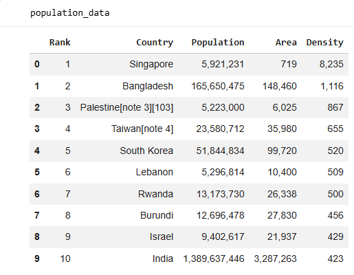

# web-scraping-beautifulsoup-pandas
Extracting and structuring web data using BeautifulSoup and Pandas, including HTML parsing, link and image scraping, and table extraction.
# Web Scraping with BeautifulSoup & Pandas

This project demonstrates how to extract, parse, and structure web data from HTML using Python.

## Tools Used
- Python
- BeautifulSoup (bs4)
- Requests
- Pandas

## What This Project Covers

### HTML Parsing
- Navigating HTML structure (tags, children, siblings)
- Extracting attributes and text content

### Web Scraping
- Extracting links (`<a>` tags)
- Extracting images (`` tags)

### Table Extraction
- Scraping structured data from HTML tables
- Iterating through rows and columns

### Data Structuring
- Converting scraped data into Pandas DataFrames

### Efficient Parsing
- Using `pd.read_html()` to directly extract tables

## Example Output

Extracted dataset of the most densely populated countries:

## Key Takeaways
- Web data can be transformed into structured datasets
- BeautifulSoup enables flexible HTML parsing
- Pandas simplifies data extraction workflows

## Files
- `web_scraping_beautifulsoup.ipynb` – Main notebook

## Author
Diane King  
Product Designer | AI + Data + UX
